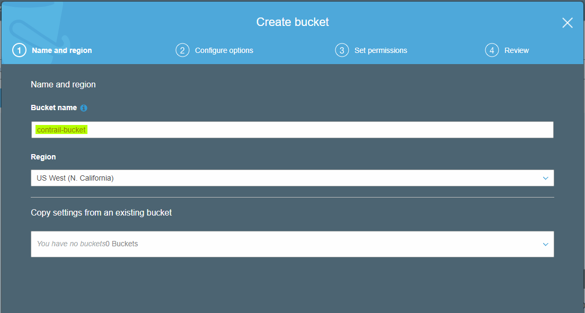
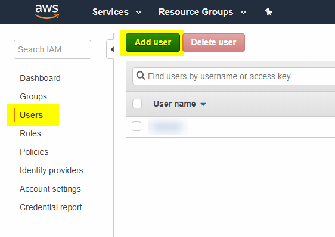
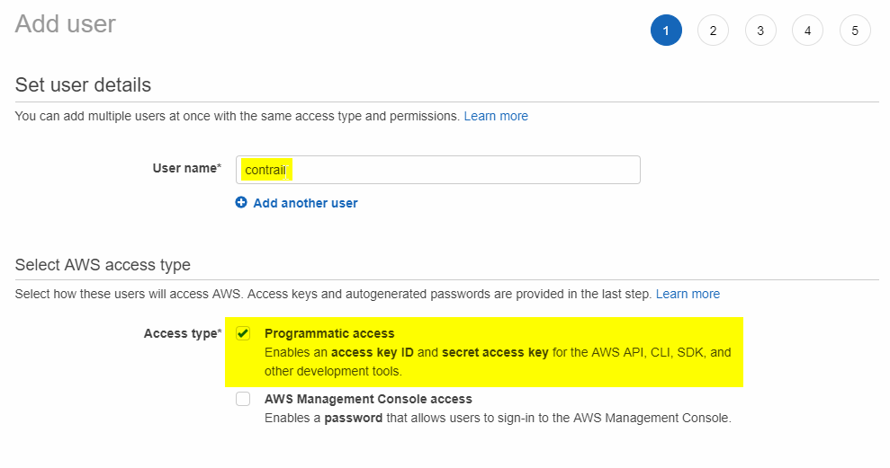
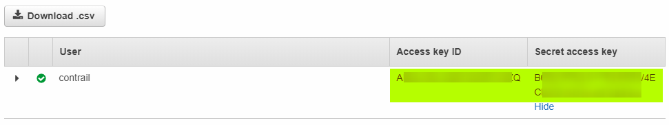
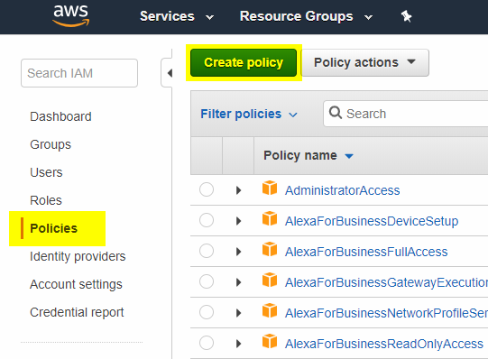
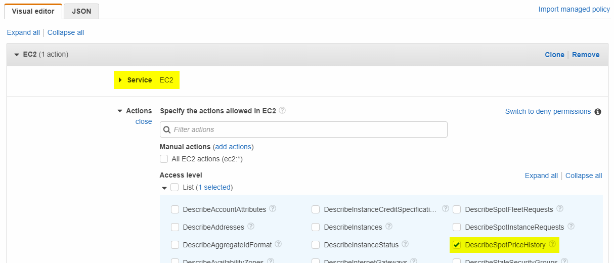
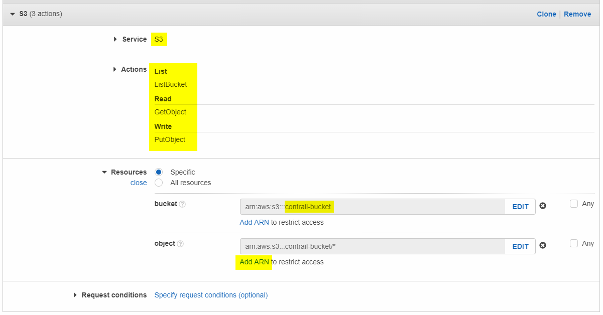
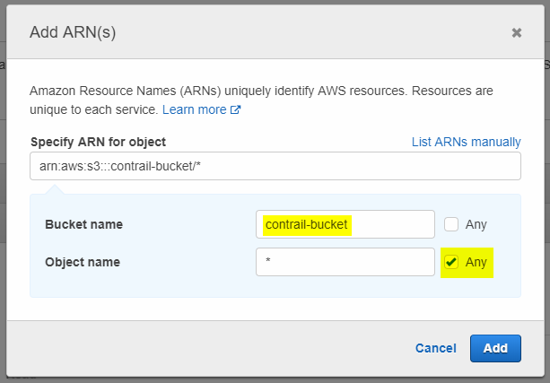
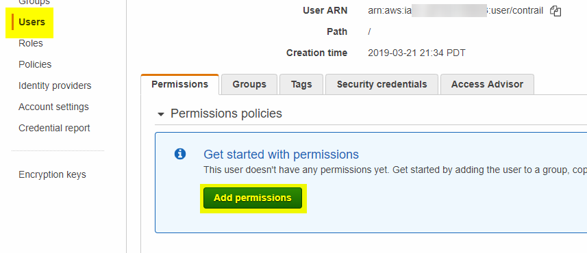
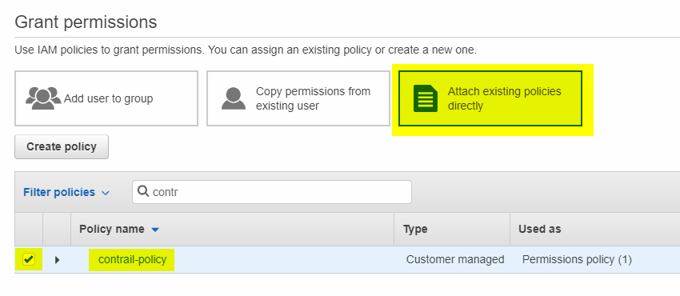

# Contrail Crawler

This module retrieves data at a fixed interval for a number of cloud service providers. It compresses and uploads this
raw data into a "Data Lake" architecture, backed by Amazon's S3 service.

## Setup

1. Create and activate a Python virtual environment in the main Contrail directory:

    ```
    virtualenv venv
    source venv/bin/activate
    ``` 

2. Install prerequisites:

    ```
    pip install -r requirements.txt
    ```

3. In the root `contrail` directory, make a copy of `config_example.py` and name it `config.py`. Obtain credentials for
   Amazon and Azure as described in the following section.

### Obtaining Credentials

The crawler needs two sets of credentials in order to run. Make a copy of `config_example.py` named `config.py` in the
root `contrail` directory. **All credentials in `config.py` are required.**

#### Amazon Web Services (AWS)

The crawler needs an Amazon S3 bucket to store the raw data it pulls from various providers, as well as an IAM user to
access that bucket and pull spot instance pricing data.

1. Create an account at [AWS](https://aws.amazon.com/) if you do not already have one.

2. Navigate to the [S3 Home](https://s3.console.aws.amazon.com/s3/home) in the AWS console. Click "Create Bucket", and
   create a bucket with any name and region you wish. Be sure to save the name you set here in `config.py` as
   **AWS_BUCKET_NAME**. All other options involved with creating a bucket can be left default or modified to fit your
   needs.
   
   

3. Navigate to [Identity and Access Management (IAM)](https://console.aws.amazon.com/iam/home) in the AWS console.
   Select "Users" on the sidebar, and click "Add User".
   
   

   Name the new user anything you would like, "contrail" is a good choice. Be sure to check "Programmatic access".

   

   For now, **do not add any permissions**. You will create and attach a policy at a more fine-grained level later.
   Navigate through the rest of the user creation, leaving it as default or modifying it to fit your needs.
   
   After creating the user, be sure to save the access key ID and secret access key in `config.py` as
   **AWS_ACCESS_KEY_ID** and **AWS_SECRET** respectively.
   
   

4. Return to the IAM homepage and select "Policies" on the sidebar. Click "Create Policy".

   

   Create the first permission to allow DescribeSpotPriceHistory. For Service, select EC2. For Actions, drop down the
   "List" access level and check "DescribeSpotPriceHistory".
   
   

   Click "Add additional permissions" at the bottom of the page, and create another permission to allow the user to
   manipulate objects in your S3 bucket. For Service, select S3. For Actions, select "ListBucket", "GetObject", and
   "PutObject" from the List, Read, and Write access levels respectively.
   
   
   
   When you click "Add ARN" next to "object", you should enter your bucket name, and check "Any" next to Object name.
   
   

5. Return to the Users tab from the IAM homepage. Select the user you made previously and click "Add permissions".

   
   
   Attach the policy you just created directly.
   
   

## Usage

1. Ensure that the virtual environment is active:

    ```
    source venv/bin/activate
    ``` 

2. Run `python contrail.py crawler`. The crawler will run until it is stopped with `^C`.
